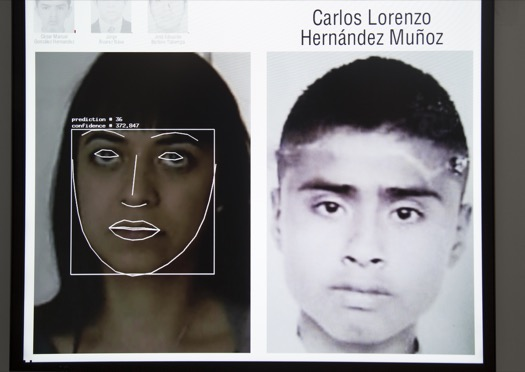
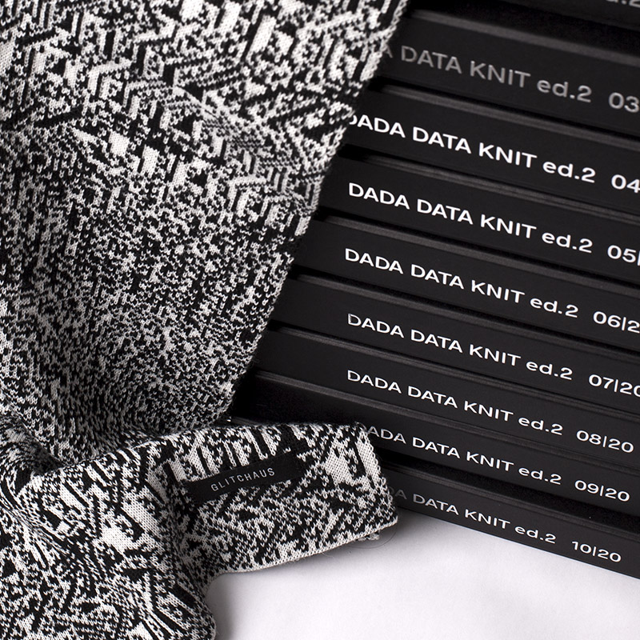
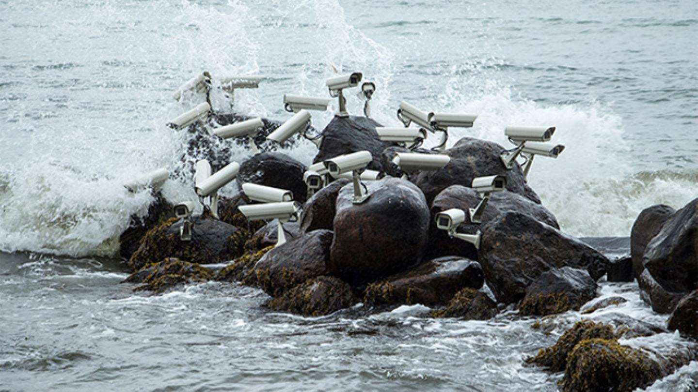
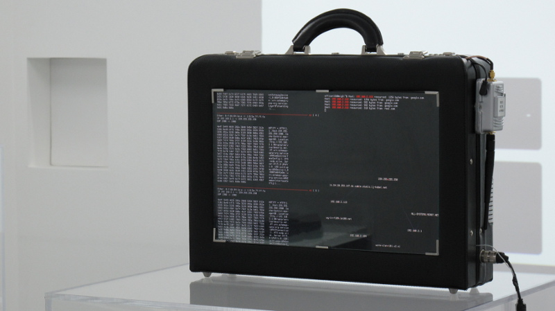
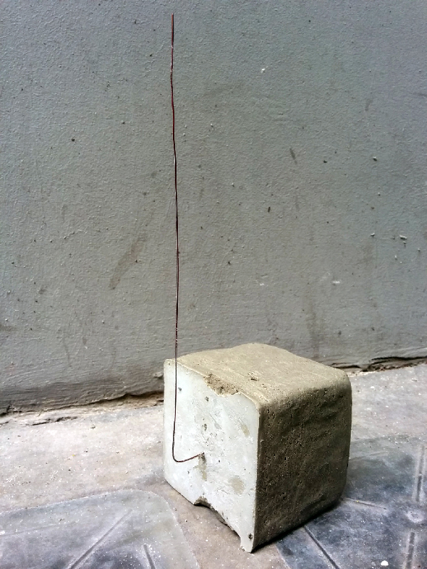
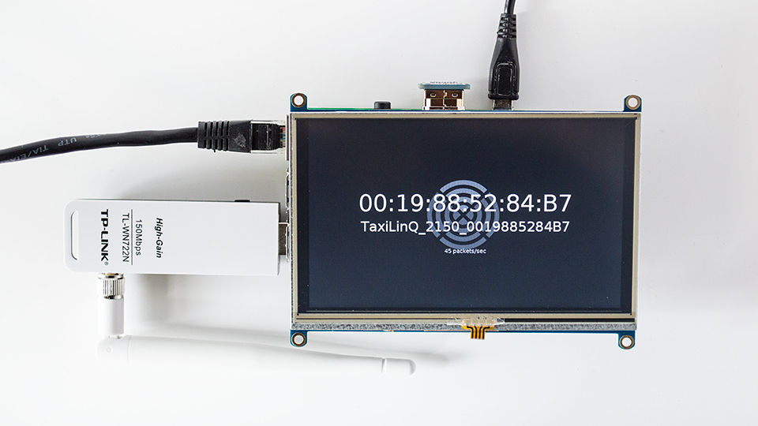

# artWarez Track

this THOTCON 0x9 proposal is for an "artWarez" track consisting of any combination of the following components:

### artWarez Gallery Show
the artWarez Gallery will be a curated show of digital artists working w/computers, networks, and topics of surveillance, security, and privacy in unconventional ways. for example...

[_Level of Confidence_, Rafael Lozano Hemmer](http://www.lozano-hemmer.com/level_of_confidence.php)

[_Data Weave_, Jeff Donaldson](http://glitchaus.com)

[_Nest 05_, Jakub Geltner](https://creators.vice.com/en_us/article/wnpzgy/a-flock-of-surveillance-cameras-nests-on-the-beach)

[_Harvest, wind energy used to mine cryptocurrency to fund climate research_, Julian Oliver](https://julianoliver.com/output/harvest)

[_Men in Grey_, Julian Oliver && Danja Vasiliev](https://criticalengineering.org/projects/men-in-grey/)

[_QFM_, Sarah Grant](http://chootka.com/projects/)

[_Skylift_, Surya Mattu](https://samatt.github.io/sky-lift/)

[_Networks of New York_, Ingrid Burrington](http://lifewinning.com/projects/networks-of-new-york/)

[_Holypager_, Brannon Dorsey (Pwbrew Organizer)](https://github.com/chootka/radical-networks/issues/120)

[_WebRoutes_, Brannon Dorsey && Nick Briz (as Branger_Briz) (Pwnebrew Organizers)](https://github.com/brangerbriz/webroutes)

[_ProbeKit_, Brannon Dorsey && Nick Briz (as Branger_Briz) (Pwnbrew Organizers)](http://probekit.brangerbriz.com)

### artWarez Talk[s]

#### Pwnbrew Artwarez Gallery Overview

A brief talk introducing and contextualizing the works in the show. Could be during an intermission or between talks.

#### Browser as Botnet, Brannon Dorsey
When surfing the web, browsers download and execute arbitrary JavaScript code they receive from websites they visit. What if high-traffic websites served obfuscated code that secretly borrowed clock cycles from their client’s web browser as a means of distributed computing? In this talk I will present research on the topic of using web browsers as zero-configuration, trojan-less botnets. The presentation will include a brief history of botnets, followed by an overview of techniques to build and deploy command-and-control botnet clients that run in-browser.

I will present exhaustive research that simulates the potential compute power of such a botnet using publicly available user-agent statistics and web traffic analytics from popular websites. What if Facebook or Google ran unnoticeably small “jobs” on your browser whenever you visited their websites? How much “free” compute could be leveraged from 2 billion users annually? With the rise of distributed computing, such a technique could be exploited to train or run machine learning models, mine a blockchain, or DDoS target servers.

In this talk we will explore the idea that the design and function of the web browser presents an opportunity for inherent exploitation. We will discuss both the ethical and nefarious use of such browser-based botnets; How they may be used in the wild and what unique affordances such a technique presents. The preparation and original research for this talk will be extensive as very little information on the subject currently exists. The talk will feature a live demo that includes conference attendees and will be followed by an open discussion into the applications and implications of deploying browser-based botnetworks.

### artWarez Audio/Video Performances

### artWarez Workshops

## Whois: Pwnbrew Club

Pwnbrew Club is a very small monthly gathering of digital artists, programmers && amateur hackers. we share + collaborate on projects w/one another relating to curious approaches to technology, "hacking" && homebrew/DIY tech. In addition to making/experimenting on projects, the members of the group have a long history in organizing digital art events in Chicago && around the world (individually && in various collaborative configurations). Below is a list of just some of these events:

### GLI.TC/H

ADD GIF HERE

[GLI.TC/H](http://gli.tc/h) was an international festival/conference/gathering of glitch art practitioners held in 2010 (Chicago), 2011 (Chicago, Amsterdam, Birmingham UK) && 2012 (Chicago). u can read more about it's [history here](http://gli.tc/h/faq/) && view short [video documentation here](https://www.youtube.com/watch?v=4hBARzlmXTI&list=PL3228E09A837979FB)

### Notacon 

Critical glitch art category

### d.r.e.a.m. (data rules everything around me)
[Data Rules Everything Around Me](http://dataruleseverythingaroundme.net/) (d.r.e.a.m.) is a roughly-monthly series held in Chicago devoted to openly discussing the implications of living in a data-driven society. Featured writers, artists, developers, and other cultural producers are invited to share their research and perspectives on the data that fuels the systems that run our world.

### POXCON

### MCA Dirty New Media Round Robin 

### R4WB1T5

### Tritriangle

### DiMoDA (The Digital Museum of Digital Art

### NO-MEDIA

### 0P3NR3P0

### T.RASHB.IN

## The Team
## PwnBrew

